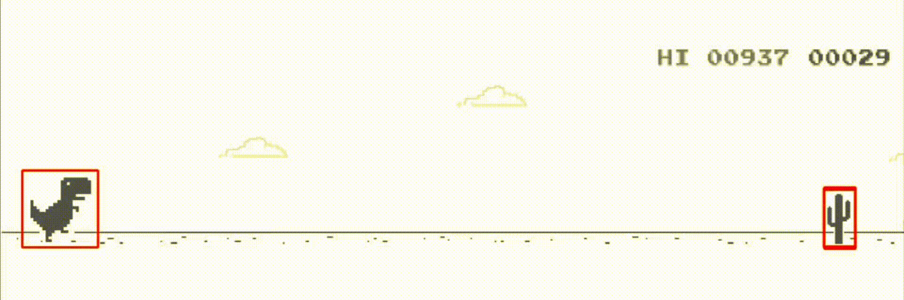

 
### Hi there, I'm SuA Lee 👋
I'm interested in **Computer Vision** and **XAI**🤍
 ◽ I want to develop lots of beautiful things using techniques from **various fields of Computer Vision.**
 ◽ And i also hope to **visualize and analyze** all deep neural networks what i want to **interpret**. (Just wishful thinking😅)
 
### Techniques I've tried in projects and researches
◽ Object Detection
 ◽ Instance Segmentation
 ◽ Video Tracking
 ◽ 3D Reconstruction
 ◽ GAN
 ◽ Pixel Attribution
 ◽ Image Augmentations
 ◽ Part of NLP, RL

<!--
**heosuab/heosuab** is a ✨ _special_ ✨ repository because its `README.md` (this file) appears on your GitHub profile.

Here are some ideas to get you started:

- 🔭 I’m currently working on ...
- 🌱 I’m currently learning ...
- 👯 I’m looking to collaborate on ...
- 🤔 I’m looking for help with ...
- 💬 Ask me about ...
- 📫 How to reach me: ...
- 😄 Pronouns: ...
- ⚡ Fun fact: ...
-->
